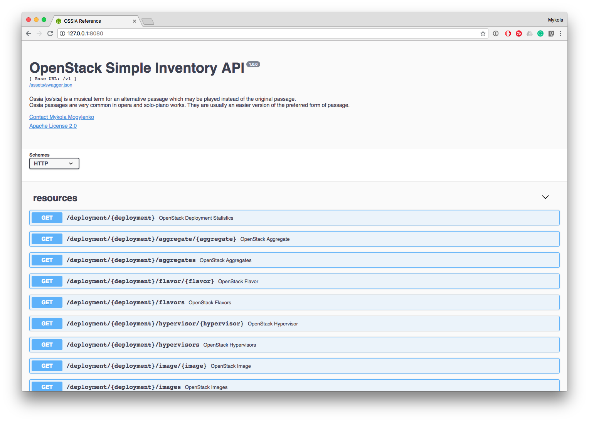
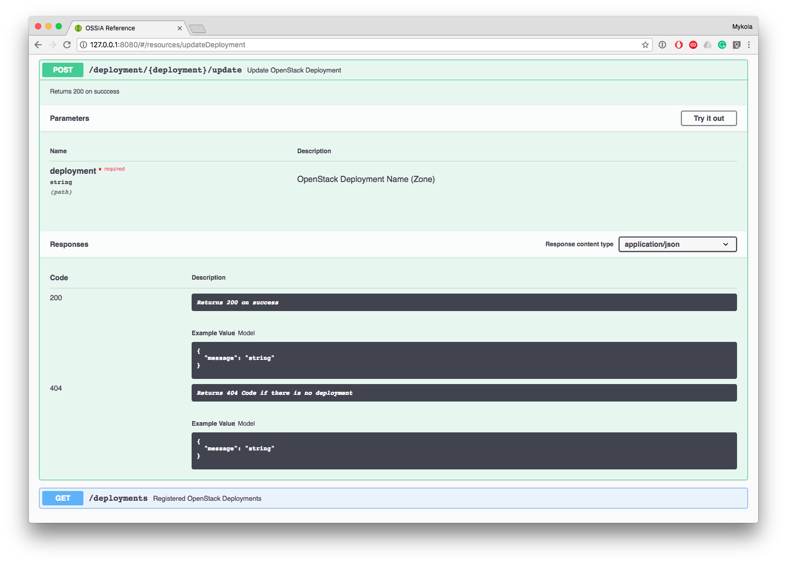

# OSSIA - OpenStack Simple Inventory API

>OSSIA is the new way to represent OpenStack Resources. It's a RESTFul API 
>which provides another view of all OpenStack Resources. Information from OpenStack API's is combined, analyzed and represented in a human-readable way so it's clear and easy to understand the current state of the OpenStack Deployment. 
>The tool also helps to make a prediction for the scaling based on current deployment utilization and oversubscription ratio. 
>OSSIA Supports multiple deployments. Plus there is is no Backend/DB/Service Dependencies. Capacity Planning made easy!

### Features

  - RESTFul API. cURL or Web UI can be used to retrieve results
  - Integrated Swagger UI for the API Reference and real-time examples
  - Time based updates for the deployment
  - Updates by request (via API)
  - OpenStack Aggregates support
  - Let's Encrypt Support
  - Daily Usage Snapshots

### API Reference

OSSIA has embedded Swagger UI Feature.





### QuickStart

#### MAKEFILE Options

```sh
$ make
build                          Build Linux binary (amd64)
package                        Build Debian & RedHat packages (amd64)
run                            Start OSSIA
clean                          Clean build arftifacts
$
```
#### Packaging
 Docker is required for ***OSSIA*** Packaging. To build ***RPM*** and ***DEB*** packages:
 
 ```sh
$ make package

... OUTPUT OMMITTED ...
-------------------------

Build Plan:
- version: 1.0.0
- commit: 68e6ce5
- branch: master
- platform: linux
- arch: amd64
- nightly? false
- race enabled? false

Starting build...
Building 'build/ossia'...

-------------------------

Packaging...
Creating package filesystem at root: /tmp/ossia-build.dG2NDr/linux/amd64/ossia-1.0.0-1
Copying Scripts and Sample configuration to build directory
Packaging directory '/tmp/ossia-build.dG2NDr/linux/amd64/ossia-1.0.0-1' as 'deb'...
MD5(build/ossia_1.0.0-1_amd64.deb) = 5d3f427a519ef54f7a1e864d1854ab77
Packaging directory '/tmp/ossia-build.dG2NDr/linux/amd64/ossia-1.0.0-1' as 'rpm'...
MD5(build/ossia-1.0.0-1.x86_64.rpm) = b00506c20fa46284bb3b767f4eb5d449

Done!
```
*deb* and *rpm* packages will be generated in ***build*** directory.


### Configuration

Main configuration file is in ***etc/conf.yml***. Simple configuration example:

```sh
---
listen_on: '127.0.0.1:8000'
auto_tls:
  enabled: false
  domain: "ossia.company.com"
  admin_email: "admin@company.com"
poll_interval:
  images: 24h
  flavors: 1h
  projects: 24h
  instances: 30m
  hypervisors: 1h
database: "db/inventory.db"
debug: False
logfile: "log/ossia.log"
deployments:
  us-west-1:
    os_auth_url: 'http://openstack.us-west-1.domain.com:5000/v3'
    os_project_name: 'admin'
    os_username: 'admin'
    os_password: 'admin_password'
```

### TODO's

 - Write Tests
 - Write OSSIA UI

### Contributing

Contributions are welcomed! Read the [Contributing Guide](./.github/CONTRIBUTING.md) for more information.

### Licensing

This project is licensed under the Apache V2 License. See [LICENSE](LICENSE) for more information.
